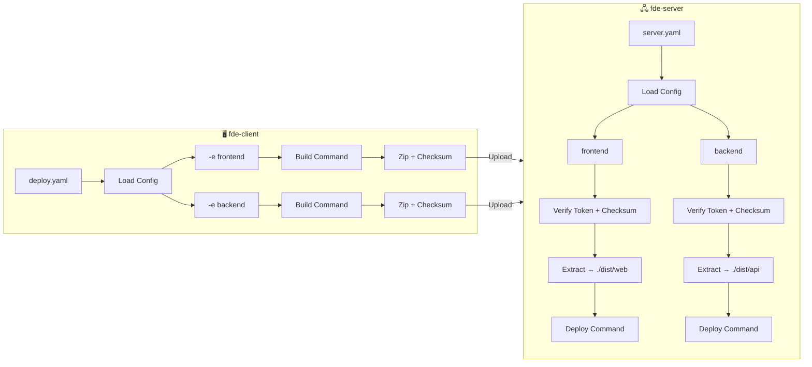

# FDE

> **A manual deployment tool for environments where CI/CD is unavailable.**
>
> Lightweight, single-binary, and air-gap ready.

[](https://github.com/yuchenii/fde/actions)
[](https://hub.docker.com/r/yuchenii/fde-server)
[](LICENSE)
[](README.md#supported-platforms)

---

## 🎯 When to use FDE?

FDE is **not** a replacement for modern CI/CD pipelines (GitHub Actions, GitLab CI). Instead, it is designed for specific scenarios where those tools cannot be used:

- **🚫 Air-Gapped Networks**: The deployment target has no internet connection.
- **🛡️ Bastion Hosts**: You must deploy through a jump server (bastion).
- **🔌 Direct Connection**: You need a simple way to push files from a local machine to a remote server.
- **⚡ Rapid Iteration**: Instant deployment without waiting for complex CI queues.

---

## 🚀 Quick Start

Follow these steps to get your deployment system up and running in minutes.

### 1. Installation

Install both the server and client binaries on your respective machines.

**macOS / Linux:**

```bash
curl -fsSL https://raw.githubusercontent.com/yuchenii/fde/main/scripts/install.sh | bash
```

**Windows (PowerShell):**

```powershell
iwr -useb https://raw.githubusercontent.com/yuchenii/fde/main/scripts/install.ps1 | iex
```

### 2. Configure Server

On your **server**, create a `server.yaml` file:

```yaml
port: 3000 # Port to listen on
environments:
  prod:
    token: "my-secret-token" # Security token for this environment
    uploadPath: "/var/www/html" # Where files will be extracted
    deployCommand: "nginx -s reload" # Command to run after extraction
```

### 3. Start Server

Start the FDE server using the config file you just created:

```bash
# Start in foreground
fde-server start -c server.yaml

# Or run in background (Daemon mode)
fde-server start -d -c server.yaml
```

### 4. Deploy

On your **local machine** (where your code is), create a `deploy.yaml` file:

```yaml
# Optional: Outer-level defaults
token: "my-secret-token" # Global token fallback
serverUrl: "http://your-server-ip:3000" # Global server URL fallback

environments:
  prod:
    # token and serverUrl inherit from outer-level if not specified
    buildCommand: "npm run build" # Command to build your project
    localPath: "./dist" # Local folder to upload
```

Then run the deploy command:

```bash
fde-client deploy -e prod
```

---

## 📖 Detailed Usage

### Commands

#### Server Commands

```bash
# Start server
fde-server start -c server.yaml

# Manage daemon (Unix-like systems only)
fde-server start -d -c server.yaml
./scripts/stop-server.sh

# Update server
fde-server upgrade

# Uninstall server
fde-server uninstall

# Check version
fde-server --version

# Show help
fde-server --help
```

#### Client Commands

```bash
# Deploy to specific environment
fde-client deploy -e prod

# Skip build step (skip build command execution)
fde-client deploy -e prod --skip-build

# Trigger deployment command only (no build/upload)
fde-client deploy -e prod --trigger-only

# Check server connectivity
fde-client ping -e prod
fde-client ping -s http://localhost:3000

# Check server health
fde-client health -e prod
fde-client health -s http://localhost:3000

# Update client
fde-client upgrade

# Uninstall client
fde-client uninstall

# Show version
fde-client --version

# Show help
fde-client --help
```

### Configuration

#### Server Configuration (`server.yaml`)

| Field            | Type     | Required | Default            | Description                                                        |
| :--------------- | :------- | :------- | :----------------- | :----------------------------------------------------------------- |
| `port`           | `number` | **Yes**  | -                  | Port for the server to listen on.                                  |
| `token`          | `string` | No       | -                  | Global security token. Used if an environment doesn't specify one. |
| `environments`   | `object` | **Yes**  | -                  | Dictionary of environment configurations (e.g., `prod`, `test`).   |
| `log.path`       | `string` | No       | `./fde-server.log` | Path to the log file. Resolved relative to config file.            |
| `log.maxSize`    | `number` | No       | `10`               | Maximum log file size in MB before rotation.                       |
| `log.maxBackups` | `number` | No       | `5`                | Number of rotated log files to keep.                               |

**Environment Object (`environments.<name>`):**

| Field           | Type     | Required | Default        | Description                                                                  |
| :-------------- | :------- | :------- | :------------- | :--------------------------------------------------------------------------- |
| `token`         | `string` | No       | Global `token` | Environment-specific token. Overrides global token.                          |
| `uploadPath`    | `string` | **Yes**  | -              | Absolute path or path relative to config file where files will be extracted. |
| `deployCommand` | `string` | **Yes**  | -              | Command executed after extraction.                                           |

#### Client Configuration (`deploy.yaml`)

| Field          | Type     | Required | Default | Description                                                  |
| :------------- | :------- | :------- | :------ | :----------------------------------------------------------- |
| `token`        | `string` | No       | -       | Global security token fallback.                              |
| `serverUrl`    | `string` | No       | -       | Global server URL fallback. Used if env doesn't specify one. |
| `environments` | `object` | **Yes**  | -       | Dictionary of environment configurations.                    |

**Environment Object (`environments.<name>`):**

| Field          | Type       | Required | Default            | Description                                                                  |
| :------------- | :--------- | :------- | :----------------- | :--------------------------------------------------------------------------- |
| `serverUrl`    | `string`   | No       | Global `serverUrl` | Full URL of the FDE server. Falls back to outer-level `serverUrl`.           |
| `token`        | `string`   | No       | Global `token`     | Auth token matching the server's environment token.                          |
| `localPath`    | `string`   | **Yes**  | -                  | Local directory or file to deploy. Resolved relative to config file.         |
| `buildCommand` | `string`   | No       | -                  | Command to run locally before upload (e.g., `npm run build`).                |
| `exclude`      | `string[]` | No       | -                  | List of glob patterns to exclude from upload (e.g., `node_modules`, `.git`). |

### 🐳 Docker Support

If you prefer using Docker for the server:

```bash
docker run -d \
  --name fde-server \
  -p 3000:3000 \
  -v "./server.yaml:/app/server.yaml:ro" \
  -v "${HOME}/.ssh/fde_docker:/root/.ssh/id_rsa:ro" \
  -v "./deploy-packages:/app/deploy-packages" \
  -v "./logs:/app/logs" \
  -e SSH_USER=yuchen \
  -e SSH_HOST=host.docker.internal \
  -e SSH_PORT=22 \
  -e HOST_CONFIG_DIR="$(pwd)" \
  -e NODE_ENV=production \
  -e TZ=Asia/Shanghai \
  --add-host host.docker.internal:host-gateway \
  yuchenii/fde-server:latest
```

See [Docker Deployment Guide](docs/docker.md) for advanced configurations.

---

## 📚 Documentation

- **[Server API Reference](docs/server-api.md)**
- **[Docker Deployment Guide](docs/docker.md)**
- **[Path Resolution](docs/path-resolution.md)**
- **[Changelog](CHANGELOG.md)**

## 🏗️ Architecture



---

## 🔧 Development

### 📋 Prerequisites

- [Bun](https://bun.sh/) >= 1.0

### 🛠️ Setup

```bash
# Install dependencies
bun install

# Start server with hot reload
bun run dev:server

# Start client with hot reload
bun run dev:client

# Run tests
bun test

# Run tests in watch mode
bun run test:watch
```

### 🔨 Build

```bash
# Build all platforms
bun run build:all

# Build specific platform
bun run build:mac
bun run build:linux
bun run build:windows

# Build specific architecture
bun run build:mac:arm64
bun run build:linux:x64
```

## 🧪 Testing

```bash
# Run all tests
bun test

# Run with coverage
bun run test:coverage

# Watch mode
bun run test:watch
```

---

## 🤝 Contributing

Contributions are welcome! Please feel free to submit a Pull Request.

## 📄 License

MIT License - see [LICENSE](LICENSE) for details.

## 🙏 Acknowledgments

- Built with [Bun](https://bun.sh/)
- Progress bars powered by [cli-progress](https://github.com/npkgz/cli-progress)
- Archive handling with [archiver](https://github.com/archiverjs/node-archiver)
