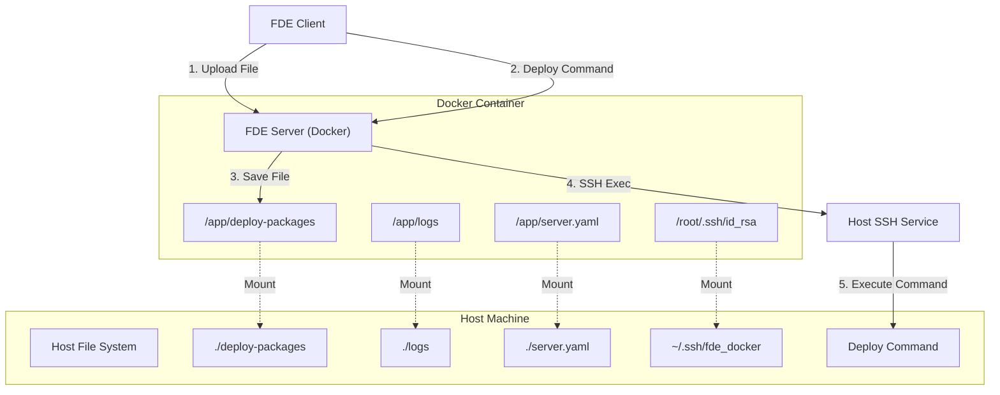

# FDE Server Docker 部署

## 1. 环境准备 (SSH Key 配置)

为了让 Docker 容器内的 FDE Server 能够操作宿主机（例如重启 Docker 容器、执行系统命令），我们需要配置 SSH 互信。

### 1.1 生成 SSH Key (在宿主机执行)

```shell
# 生成 key (无密码)
ssh-keygen -t rsa -b 4096 -f ~/.ssh/fde_docker -N ""

# 添加 key 到 authorized_keys
cat ~/.ssh/fde_docker.pub >> ~/.ssh/authorized_keys
chmod 600 ~/.ssh/authorized_keys

# 检查是否配置成功，如果成功会输出 Success
ssh -i ~/.ssh/fde_docker root@127.0.0.1 echo "Success"
```

### 1.2 构建/加载镜像 (可选)

如果你需要手动构建或加载镜像：

```shell
# 构建镜像 (x86)
docker build --platform linux/amd64 -t yuchenii/fde-server:latest .

# 构建镜像 (arm64)
docker build --platform linux/arm64 -t yuchenii/fde-server:latest .

# 构建多架构镜像并推送
docker buildx build --platform linux/amd64,linux/arm64 -t yuchenii/fde-server:latest -t yuchenii/fde-server:v1.2.0 --push .

# 或者加载离线镜像
docker load -i ./fde-server.tar
```

## 2. 服务端目录结构

容器内部的关键目录结构如下，server.yaml 中的 deployPath 需要与挂载的 deploy-packages 目录一致：

```
/app
├── server.yaml       # [配置文件] 核心配置
├── logs/             # [日志目录] 存放运行日志
│   └── fde-server.log
├── deploy-packages/  # [部署目录] 存放上传的构建产物
│   ├── test/
│   └── prod/
└── ... (Server 代码)
```

## 3. 部署配置

### 3.1 Docker Run

使用 `docker run` 快速启动，注意挂载刚才生成的 SSH Key：

```bash
docker run -d \
  --name fde-server \
  -p 3000:3000 \
  -v "./server.yaml:/app/server.yaml:ro" \
  -v "${HOME}/.ssh/fde_docker:/root/.ssh/id_rsa:ro" \
  -v "./deploy-packages:/app/deploy-packages" \
  -v "./logs:/app/logs" \
  -e SSH_USER=yuchen \
  -e SSH_HOST=host.docker.internal \
  -e SSH_PORT=22 \
  -e HOST_PROJECT_PATH="$(pwd)" \
  -e NODE_ENV=production \
  -e TZ=Asia/Shanghai \
  --add-host host.docker.internal:host-gateway \
  yuchenii/fde-server:latest
```

### 3.2 Docker Compose (推荐)

创建 `docker-compose.yml`：

```yaml
version: "3"

services:
  fde-server:
    # Use build for local development, use image for production
    build:
      context: .
      dockerfile: Dockerfile
    # image: yuchenii/fde-server:latest
    container_name: fde-server

    # For docker to connect to host machine
    extra_hosts:
      - host.docker.internal:host-gateway

    ports:
      - 3000:3000

    volumes:
      # Server config
      - ./server.yaml:/app/server.yaml:ro
      # SSH key for docker to connect to host machine
      - ${HOME}/.ssh/fde_docker:/root/.ssh/id_rsa:ro
      # Deploy packages, must be same as deployPath in server.yaml
      - ./deploy-packages:/app/deploy-packages
      # Logs
      - ./logs:/app/logs

    environment:
      # Change to your host machine username
      - SSH_USER=root
      # Change to your host docker gateway ip, usually 172.17.0.1
      - SSH_HOST=host.docker.internal
      # Change to your host machine ssh port
      - SSH_PORT=22
      # Server config path, used to resolve relative paths in deployCommand
      - HOST_PROJECT_PATH=/data/projects/app
      - NODE_ENV=production
      - TZ=Asia/Shanghai

    restart: unless-stopped
```

### 3.3 配置文件 (server.yaml)

`server.yaml` 是 FDE Server 的核心配置文件。

```yaml
# 服务器端口
port: 3000

# 全局认证 Token (可选，如果环境配置中未指定则使用此 Token)
token: "your-secret-token"

# 日志配置
log:
  path: "./logs/fde-server.log" # Docker 内通常不需要修改，默认 /app/logs/...
  maxSize: 10 # MB
  maxBackups: 5

# 环境配置
environments:
  # 测试环境
  test:
    token: "test-token" # 覆盖全局 Token
    deployPath: "./deploy-packages/test" # 部署包路径
    deployCommand: "./scripts/deploy-test.sh" # 部署脚本或命令

  # 生产环境
  prod:
    token: "prod-token"
    deployPath: "./deploy-packages/prod"
    deployCommand: "./scripts/deploy-prod.sh"
```

## 4. 架构与原理

FDE Server 在 Docker 中运行的核心原理是通过 **Volume 挂载** 实现文件共享，通过 **SSH** 实现宿主机控制。

### 4.1 架构图



### 4.2 核心流程解析

1.  **文件挂载 (Mounting)**:

    - 客户端上传的文件被保存到容器内的 `/app/deploy-packages`。
    - 由于配置了 Volume (`./deploy-packages:/app/deploy-packages`)，文件实际被写入到了宿主机的对应目录。
    - 这确保了即使容器销毁，部署包依然存在，且宿主机上的其他服务（如 Nginx）可以直接访问这些静态文件。

2.  **命令执行 (Execution)**:
    - 当 Server 接收到部署命令时，它需要操作宿主机资源（例如 `docker restart`）。
    - Server 读取挂载进来的 SSH 私钥 (`/root/.ssh/id_rsa`)。
    - Server 通过 SSH 连接到 `SSH_HOST` (即宿主机)。
    - Server 在宿主机上执行 `cd HOST_PROJECT_PATH && <deploy_command>`。
    - 这样就实现了在容器内安全地控制宿主机环境。
